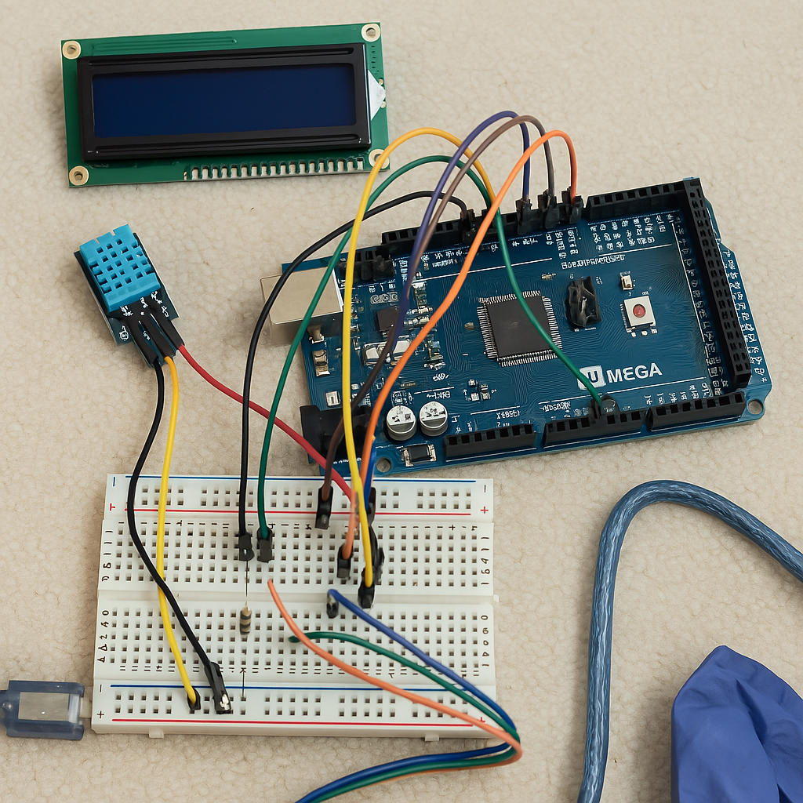
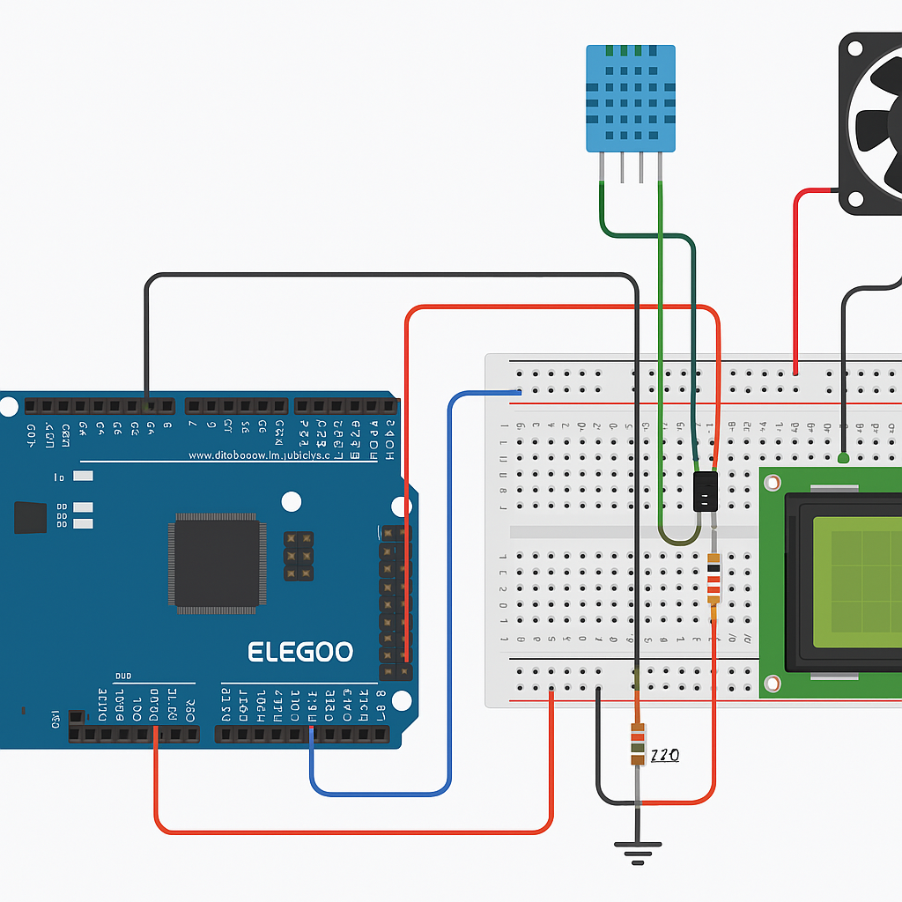

# Smart-Environment-Monitor-Robot
IoT + Automation project with Arduino MEGA, LCD, DHT11

# 🤖 Smart Environment Monitor Robot

An IoT-based environment monitoring system using Arduino MEGA. It reads temperature and humidity via a DHT11 sensor, displays values on an LCD1602, and contains logic to trigger a fan when it's too hot — even though the fan hardware isn't connected yet.

---

## 🧭 Why I Developed This Project

I wanted to create a simple but impactful system that demonstrates how **IoT and automation can work together in real life**. My goal was to build something that senses the environment, responds intelligently, and could easily scale into a full robot or smart system.

---

## 🎯 Objective

To design and prototype a Smart Environment Monitor using basic electronics that:
- Collects temperature & humidity data
- Displays information on a screen in real-time
- Contains automation logic to respond (e.g., turn on a fan)
- Is scalable for future enhancements like cloud sync or mobile robots

---

## 📚 What You’ll Learn (If You Follow This Project)

- ✅ How to wire and program a **DHT11 sensor + LCD1602 display**  
- ✅ How to share **power rails and manage breadboard wiring**  
- ✅ How to write **Arduino code that reacts to sensor data**  
- ✅ Basics of using **transistors to control external devices (like a fan)**  
- ✅ How to think modular: build now, upgrade later with Wi-Fi, cloud, or mobility

---

## 📸 Project Overview

| Setup | Circuit Diagram | 
|-------|------------------|
|  |  | 

---

## 💡 Features

- Real-time temperature & humidity monitoring
- LCD1602 (non-I2C) used to display sensor readings
- Logic built to control a fan via digital output
- Modular and upgradable for full automation

---

## 🔧 Components Used

| Component | Quantity | Purpose |
|----------|----------|---------|
| **Arduino MEGA 2560** | 1 | Main microcontroller board (brain of the system) |
| **DHT11 Sensor** | 1 | Measures temperature and humidity |
| **LCD1602 Display (non-I2C)** | 1 | Displays temperature and humidity readings |
| **Breadboard** | 1 | Builds the circuit without soldering |
| **Jumper Wires (Male-to-Male)** | ~15–20 | Connect components on breadboard and MEGA |
| **220Ω Resistor** | 1 | Current-limiting resistor for transistor base |
| **PN2222 Transistor (NPN)** | 1 | Acts as a switch to control the fan (planned logic) |
| **1N4007 Diode** | 1 | Protects against back EMF from motor/fan |
| **Small DC Fan (optional)** | 1 | To be activated when temp > 30°C (not connected yet) |
| **USB Cable** | 1 | To power and upload code to Arduino MEGA from laptop |
| **Potentiometer (optional)** | 1 | Adjusts LCD contrast (if used) |

---

- Arduino MEGA 2560
- DHT11 Sensor
- LCD1602 (without I2C module)
- Breadboard + Jumper Wires
- Logic for: Transistor + Fan Circuit (future)

---

## 🧠 Fan Logic (Code Only for Now)

```cpp
#define FANPIN 8

if (temp > 30) {
  digitalWrite(FANPIN, HIGH);  // Logic level HIGH
  Serial.println("Fan ON (logic only)");
} else {
  digitalWrite(FANPIN, LOW);
  Serial.println("Fan OFF (logic only)");
}
```

> The fan is not connected physically, but logic is tested and working in Serial Monitor.

---

## 🧪 Challenges Faced

- Wiring LCD1602 manually without I2C
- Managing shared power rails on breadboard
- Fan module and transistor switch debugging (incomplete)

---

## 🚀 Future Upgrades

- Add I2C module to reduce wiring
- Connect physical fan and transistor
- Use ESP8266 for cloud-based data sync
- Display mood on LCD or blink LEDs based on readings

---

## 👩‍💻 Built by [@bhavyaraoulji](https://github.com/bhavyaraoulji)

📫 Connect with me:
- 💼 [LinkedIn](https://www.linkedin.com/in/bhavyaraoulji)
- 📸 [Instagram @breethexplorer](https://www.instagram.com/breethexplorer)


🧠 "I’ve programmed the brain and set up the eyes. I just haven't added the hands yet."


🎯 :
“While the fan hardware isn’t hooked up yet, the system is fully prepared for actuation — with logic and output pin mapping in place. It's ready for automation as soon as the fan module is finalized.”


